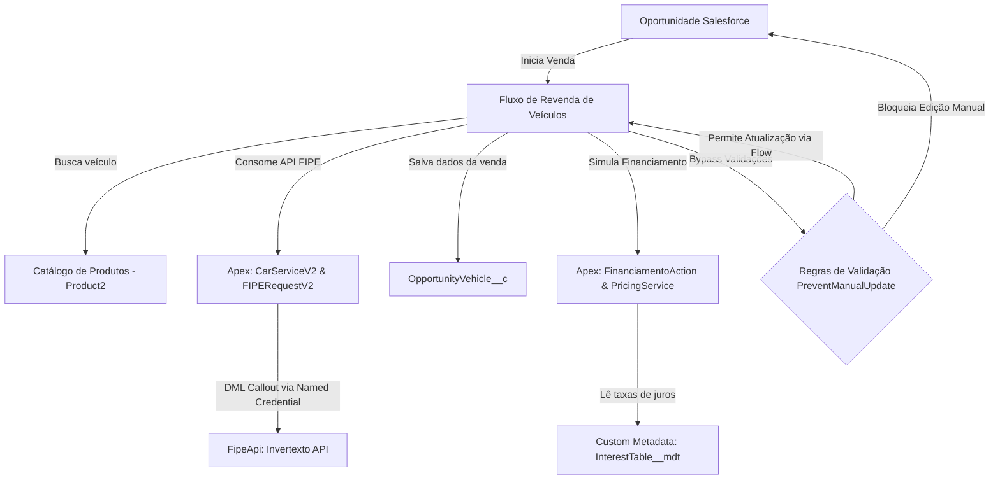

# Documentação Técnica: Projeto Revendedora de Carros (Salesforce)

Esta documentação fornece uma análise detalhada e abrangente de todo o ecossistema do projeto **Revendedora de Carros**, detalhando a modelagem de dados, regras de validação, lógica financeira, integrações de APIs e as automações transacionais integradas.

---

## 1. Visão Geral da Solução

O projeto é uma solução construída na plataforma **Salesforce** (utilizando o modelo de desenvolvimento Salesforce DX) para informatizar e controlar a venda e financiamento de veículos. A solução guia os vendedores pelas etapas de qualificação de oportunidades através de um assistente interativo (*Screen Flow*), integrando-se em tempo real a provedores externos de preços de tabela FIPE e realizando o cálculo de parcelamentos com taxas de juros variáveis armazenadas em metadados da organização.

---

## 2. Diagrama de Arquitetura da Solução

O fluxo de dados e a integração entre componentes declarativos (Flows e Regras de Validação), imperativos (Classes Apex) e configurações externas (Named Credentials e Custom Metadata) seguem a estrutura abaixo:



---

## 3. Modelo de Dados (SObjects e Metadados)

Abaixo estão detalhados os objetos padrão e customizados que sustentam o projeto:

### A. Oportunidade (`Opportunity`)
Representa a negociação comercial da venda do veículo.
*   **`PaymentType__c`** (Picklist): Define o tipo de pagamento. Valores válidos: `À Vista`, `Financiamento`.
*   **`DownPayment__c`** (Moeda): Valor pago como entrada para o financiamento do carro.
*   **`FinancingTerm__c`** (Picklist): Prazo do parcelamento em meses. Valores válidos: `12`, `24`, `36`, `48`, `60`.
*   **`AllowFieldsUpdateBypass__c`** (Checkbox): Campo de controle técnico para liberação temporária de validações do sistema.

### B. Veículo da Oportunidade (`OpportunityVehicle__c`)
Objeto customizado que atua como a junção entre a Oportunidade comercial e o veículo vendido.
*   **`Opportunity__c`** (Lookup de Oportunidade): Relacionamento master-detail ou lookup que liga à negociação correspondente.
*   **`Product__c`** (Lookup de Produto): Liga o veículo ao catálogo oficial de produtos (`Product2`).
*   **`FipeReferencePrice__c`** (Moeda): O preço do veículo na tabela FIPE retornado pela integração no momento da venda.
*   **`ProposedSalePrice__c`** (Moeda): O valor final de venda negociado pelo vendedor.
*   **`Discount__c`** (Percentual): A porcentagem de desconto concedida em compras à vista.
*   **`AllowFieldsUpdateBypass__c`** (Checkbox): Flag de bypass de segurança específico para este registro.

### C. Catálogo de Veículos (`Product2`)
Utiliza a tabela padrão de produtos do Salesforce com campos customizados adicionais expostos ao Flow:
*   **`FipeCode__c`** (Texto): Código FIPE identificador do modelo do veículo.
*   **`ModelYear__c`** (Texto): Ano do modelo do veículo (ex: "2020", "2023").
*   **`Brand__c`** (Texto): Marca do veículo (ex: "Chevrolet", "Ford").
*   **`Transmission__c`** (Texto/Picklist): Tipo de câmbio (ex: "Manual", "Automático").

### D. Tabela de Juros (`InterestTable__mdt`)
Metadado customizado utilizado para definir as taxas de juros por prazo (Termo) de parcelamento contratado:
*   **`Term__c`** (Texto/Chave): O prazo do financiamento correspondente em meses (12, 24, 36, 48, 60).
*   **`Level1Rate__c`** (Número/Taxa): Taxa de juros padrão mensal aplicável se a entrada for inferior a 60% do valor do carro.
*   **`Level2Rate__c`** (Número/Taxa): Taxa de juros reduzida mensal aplicável se a entrada for maior ou igual a 60% do valor do carro.

---

## 4. Decisão de Arquitetura Crucial: Fórmulas Reativas no Flow vs. Métodos Apex

> [!IMPORTANT]
> **Destaque de Design e Arquitetura: Utilização de Fórmulas no Flow em substituição às classes Apex `MargemAction` e `DescontoAction`**
>
> Originalmente, o escopo técnico do projeto previa a criação de classes invocáveis Apex para o cálculo da Margem Base (`MargemAction`) e do Desconto (`DescontoAction`). No entanto, esses cálculos foram implementados utilizando **Fórmulas Declarativas internas do Flow**, uma decisão justificada tecnicamente para garantir a **Reatividade na UI**.
>
> **Motivação Técnica:**
> *   A invocação de métodos Apex a partir de um Screen Flow exige a transição de elementos no canvas (mudança de tela ou nó de ação intermediário). Isso inviabiliza a reatividade em tempo real na interface do usuário (UI).
> *   Ao implementar os cálculos via Fórmulas do Flow, a interface recalcula instantaneamente o valor final com desconto ou a margem sugerida conforme o usuário digita nos campos da mesma tela (ex: alterando a porcentagem de desconto no input), sem a necessidade de clicar em avançar ou recuar.
> *   Desta forma, os arquivos de classe `MargemAction.cls` e `DescontoAction.cls` tornaram-se desnecessários na org, mantendo o ecossistema de código limpo e oferecendo uma experiência de usuário (UX) moderna e sem latência.

--- 

## 5. Detalhamento do Screen Flow (`Revenda_de_Veiculos_Screen_Flow`)

O Screen Flow é o orquestrador visual do projeto. Abaixo está o detalhamento de suas telas, campos de entrada e a lógica de banco de dados executada nos bastidores:

### A. Telas e Componentes de Interface

1.  **Tela de Prospecção (`ProspectingScreen`)**
    *   *Objetivo*: Introduzir o processo quando a Oportunidade está no estágio inicial de Prospecção.
    *   *Componentes*: Mensagens em formato rico (HTML) informando a necessidade de iniciar a escolha do carro. Botão único de avanço rotulado como `Iniciar Escolha`.
2.  **Tela de Seleção de Veículo (`VehicleSelectionScreen`)**
    *   *Objetivo*: Exibir o catálogo de veículos para escolha do vendedor.
    *   *Componentes*:
        *   **`ProductsTable`** (Tabela de dados do tipo `Product2`): Mapeia as colunas `Brand__c` (Marca), `Name` (Nome), `ModelYear__c` (Ano/Modelo) e `Transmission__c` (Transmissão). Está configurado para seleção única obrigatória (`SINGLE_SELECT`) e possui barra de pesquisa nativa habilitada.
3.  **Tela de Avaliação de Preço (`priceEvaluation`)**
    *   *Objetivo*: Apresentar o preço FIPE retornado e capturar o valor de venda desejado.
    *   *Componentes*:
        *   **`CarDetailsTextPriceEvaluationScreen`** (Display Text): Exibe em destaque a marca, nome e ano do carro selecionado na tela anterior.
        *   **`fipeValueCurrencyInput`** (Moeda): Exibe o valor de referência FIPE retornado pela classe Apex. Está marcado como **Desabilitado** e **Somente Leitura** para evitar alterações.
        *   **`proposedValueCurrencyInput`** (Moeda): Campo obrigatório de entrada para o valor da proposta. Recebe por padrão o valor calculado pela fórmula `proposedSalePriceDefault` (FIPE + 12%).
        *   *Validação*: Exige margem mínima de 5% sobre a FIPE através da fórmula de validação do componente.
4.  **Tela de Definição Financeira (`financialDefinitionScreen`)**
    *   *Objetivo*: Coletar as definições de pagamento da compra.
    *   *Componentes*:
        *   **`Tipo_de_Pagamento`** (Dropdown): Mapeia a Picklist global `Opportunity.PaymentType__c`.
        *   **Seção de Financiamento (`financedSection`)**: Exibida apenas se o tipo de pagamento for "Financiamento" (Regra de visibilidade dinâmica).
            *   *`DownPaymentInput`* (Moeda): Entrada financeira. Possui validação que exige o mínimo de 30% do valor proposto (`minimumDownPayment`).
            *   *`financingTermInput`* (Dropdown): Mapeia a Picklist `Opportunity.FinancingTerm__c`.
        *   **Seção À Vista (`inCashInformationSection`)**: Exibida apenas se o tipo de pagamento for "À Vista".
            *   *`DiscountInput`* (Número): Campo de desconto percentual (padrão `0.0%`). Possui validação que impede que o valor final com desconto fique abaixo do preço mínimo exigido (`isDiscountEligible`).
5.  **Telas de Proposta Formal**
    *   **Proposta À Vista (`formalProposalCashPaymentScreen`)**: Exibe as condições finais em HTML (Preço proposto, Desconto % e Preço final com desconto) e solicita o aceite no Dropdown obrigatório `AceitarPropostaInCash` (Opções: `Aceito`, `Não Aceito`).
    *   **Proposta Financiamento (`formalProposalFinancingScreen`)**: Exibe o plano em HTML (Valor da Entrada, número de parcelas, valor mensal retornado do Apex, valor total financiado e valor final consolidado) e solicita o aceite no Dropdown obrigatório `Aceitar_Proposta`.

### B. Elementos de Banco de Dados (DML e Consultas)

*   **`getOpportunityByRecordId` (Record Lookup)**: Busca o registro correspondente da `Opportunity` utilizando a variável global de entrada `recordId`.
*   **`Get_Products` (Record Lookup)**: Consulta a tabela `Product2` filtrando apenas registros onde `FipeCode__c` não é nulo.
*   **`GetExistingOpportunityVehicle` (Record Lookup)**: Busca na base por um `OpportunityVehicle__c` existente que ligue a oportunidade atual (`recordId`) ao produto selecionado na tabela (`ProductsTable.firstSelectedRow.Id`). Previne a duplicação de registros de veículos na mesma oportunidade.
*   **`UpsertOpportunityVehicle` (Record Create/Update)**: Realiza o DML do tipo Upsert usando a variável `newOpportunityVehicle`. O Salesforce decide se insere ou atualiza o registro com base na existência do ID capturado na busca anterior.
*   **Atualizadores de Estágio (Record Updates)**: Elementos individuais (`UpdateOppStageToSelecaoDeVeiculo`, `UpdateOppStageToAvaliacaoDePreco`, etc.) que executam o DML na oportunidade de forma atômica para refletir o progresso do vendedor.

---

## 6. Mapeamento das Classes Apex Invocáveis

As classes Apex atuam como pontes lógicas chamadas de dentro do Flow. Elas utilizam assinaturas específicas com anotações `@InvocableMethod` e classes DTO internas anotadas com `@InvocableVariable`:

### A. Integração FIPE: `CarServiceV2.cls`

Esta classe é invocada após o usuário selecionar um veículo para obter o preço de tabela do veículo.

*   **Assinatura do Método**:
    ```java
    @InvocableMethod(callout=true label='Get Car Details By FipeCode' category='Category')
    public static List<CarResponse> getCarDetails(List<CarRequest> carRequests)
    ```
    *(Nota: `callout=true` é obrigatório para permitir requisições HTTP durante a transação do Flow).*

*   **Estrutura do DTO de Entrada (`CarRequest`)**:
    ```java
    public class CarRequest {
        @InvocableVariable(required = true) public String fipeCode; // Código FIPE do veículo
        @InvocableVariable(required = true) public String modelYear; // Ano do modelo (ex: "2022")
    }
    ```

*   **Estrutura do DTO de Saída (`CarResponse`)**:
    ```java
    public class CarResponse {
        @InvocableVariable public Decimal fipeReferencePrice; // Preço decimal limpo
        @InvocableVariable public Boolean isSuccess;          // Status da integração
        @InvocableVariable public String errorMessage;        // Mensagem de erro em caso de falha
    }
    ```

*   **Funcionamento**: A classe recebe a lista de requisições, itera sobre ela e chama o método `FIPERequestV2.getCarPriceByFipe(fipeCode, modelYear)`. O resultado preenche o DTO de resposta que retorna ao Flow.

### B. Cálculo Financeiro: `FinanciamentoAction.cls`

Invocada no estágio de definição financeira para obter o detalhamento de parcelas do financiamento.

*   **Assinatura do Método**:
    ```java
    @InvocableMethod(label='Calcular Valor Total do Financiamento' category='Category')
    public static List<Response> executeCalculateFinancingTotalValue(List<Request> requests)
    ```

*   **Estrutura do DTO de Entrada (`Request`)**:
    ```java
    public class Request {
        @InvocableVariable(label='Preço Total Proposto' required=true) public Decimal proposedPrice;
        @InvocableVariable(label='Entrada' required=true) public Decimal downPayment;
        @InvocableVariable(label='Prazo de Pagamento (Meses)' required=true) public Integer months;
    }
    ```

*   **Estrutura do DTO de Saída (`Response`)**:
    ```java
    public class Response {
        @InvocableVariable(label='Valor total do Financiamento') public Decimal totalFinancedValue;
        @InvocableVariable(label='Valor das Parcelas') public Decimal installmentValues;
        @InvocableVariable public Boolean isSuccess;
        @InvocableVariable public String errorMessage;
    }
    ```

*   **Funcionamento**: Passa os dados de entrada para `PricingService.calculateFinancingTotalValue`. O valor total financiado retornado é então dividido pelo número de parcelas (`months`) para obter o valor da parcela mensal (`installmentValues`).

---

## 7. Lógica Interna das Classes Auxiliares Apex

Abaixo está o detalhamento lógico das classes de suporte responsáveis pelas integrações de chamadas HTTP e cálculos financeiros (regras de taxas de juros e descontos).

### A. Classe de Consulta HTTP: `FIPERequestV2.cls`

Esta classe executa o callout HTTP para a API externa FIPE.
*   **Construção da Requisição**:
    *   Define o endpoint dinamicamente anexando o código FIPE na credencial nomeada: `callout:FipeApi/{fipeCode}`.
    *   Usa o método HTTP `GET`.
*   **Tratamento de Resposta e Fluxo de Exceção**:
    *   *Erro na conexão/transmissão*: Se o envio falhar por tempo limite ou indisponibilidade, lança um erro customizado `FipeRequestException`.
    *   *Código HTTP diferente de 200 (Sucesso)*: Desserializa o corpo de erro da resposta no DTO e lança a exceção customizada exibindo a mensagem retornada pela API externa (ex: token inválido, limite excedido).
    *   *Código HTTP 200 (Sucesso)*: 
        *   Desserializa a resposta JSON com `FipeApiResponseDTO.parse(body)`.
        *   Realiza uma iteração (varredura) na lista de anos retornados (`responseDTO.years`).
        *   Se encontrar um objeto `AnnualValue` cujo ano do modelo seja idêntico ao solicitado (`model_year == year`) e possua valor de preço não nulo, retorna imediatamente esse valor (`Decimal price`).
        *   Se a varredura terminar sem localizar o ano do modelo correspondente, lança `FipeRequestException` informando que o veículo não foi encontrado para aquele ano.

### B. Classe de Cálculo Financeiro: `PricingService.cls`

Esta classe isola as fórmulas de cálculo e a lógica de verificação de regras financeiras.

*   **Método `calculateFinancingTotalValue` (Financiamento)**:
    1.  *Validação de Parâmetros*: Garante que o valor proposto não seja nulo, menor ou igual a zero, e que a entrada e o prazo de meses estejam preenchidos.
    2.  *Entrada Completa*: Se o valor da entrada for igual ou superior ao preço proposto do veículo, a compra não precisa ser financiada; retorna juros zero e saldo a pagar de `0.00`.
    3.  *Base de Financiamento*: Subtrai a entrada do preço proposto para definir a base de cálculo (`totalPrice = proposedPrice - downPayment`).
    4.  *Consulta de Juros no Custom Metadata*:
        *   Chama `InterestTable__mdt.getAll()` para ler as tabelas de taxas na memória da transação.
        *   Filtra na lista para localizar o registro cuja coluna `Term__c` corresponda ao prazo de meses informado. Caso não exista tabela de taxas cadastrada para aquele prazo, lança uma exceção `AuraHandledException`.
    5.  *Classificação da Taxa de Entrada*:
        *   Calcula o limite de 60% do valor proposto do veículo (`proposedPrice * 0.60`).
        *   Se o valor da entrada dada pelo cliente for maior ou igual a esse limite, aplica a taxa mensal reduzida (`Level2Rate__c / 100`).
        *   Caso contrário, aplica a taxa mensal padrão (`Level1Rate__c / 100`).
    6.  *Aplicação de Juros Simples e Arredondamento*:
        *   Multiplica a base de financiamento pela taxa mensal selecionada e pelo prazo em meses: `totalInterest = totalPrice * interestPerMonth * months`.
        *   Soma o principal aos juros e aplica o arredondamento para duas casas decimais com `setScale(2)`.
*   **Método `calculateDiscount` (Pagamento à Vista)**:
    *   Realiza a aplicação matemática direta do percentual sobre o preço total: `proposedPrice - (proposedPrice * (discount / 100))`.

---

## 8. Integração com a API FIPE: Evolução (v1 vs v2)

O projeto contém duas implementações da API de consulta FIPE, evidenciando uma refatoração focada em robustez e qualidade de dados:

### Integração Antiga (v1)
*   **Classes**: `FIPERequest.cls` e `CarService.cls`
*   **Named Credential**: `BrasilApi` (`https://brasilapi.com.br/api/fipe/preco/v1/`)
*   **Limitações**:
    *   O retorno do preço pela BrasilAPI é uma String formatada contendo símbolos monetários locais (exemplo: `"R$ 82.500,00"`).
    *   Exigia processamento manual no Apex (`parseCurrency`) via Regex e manipulação de Strings (`replace('R$', '').replace('.', '')`) para convertê-lo em `Decimal`. Esse processo é suscetível a falhas caso o formato retornado mude ligeiramente.

### Integração Nova (v2)
*   **Classes**: `FIPERequestV2.cls`, `CarServiceV2.cls` e `FipeApiResponseDTO.cls`
*   **Named Credential**: `FipeApi` (`https://api.invertexto.com/v1/fipe/years/`)
*   **Melhorias**:
    *   A API Invertexto retorna uma estrutura DTO hierárquica clara (mapeada no Apex pelo DTO `FipeApiResponseDTO`).
    *   O preço de referência já é retornado nativamente como valor numérico decimal (`Decimal price`), eliminando a necessidade de qualquer parsing textual de Strings.
    *   A classe busca pelo ano do modelo correspondente e filtra de forma limpa na lista.

---

## 9. Regras de Negócio e Lógica Financeira

O sistema assegura a rentabilidade e a consistência das vendas por meio de regras aplicadas no Flow e no motor Apex de precificação (`PricingService.cls`):

### Precificação e Margens
1.  **Preço de Venda Padrão**: O preço inicial sugerido para negociação do carro é calculado pela fórmula:
    $$\text{Preço Padrão} = \text{Preço de Referência FIPE} \times 1.12 \quad (+12\%)$$
2.  **Preço de Venda Mínimo**: A margem mínima exigida impede que qualquer carro seja negociado por valor inferior a:
    $$\text{Preço Mínimo} = \text{Preço de Referência FIPE} \times 1.05 \quad (+5\%)$$
    Esta regra é forçada tanto na validação do Flow quanto na regra de validação de banco `BlockSalesPriceBelowFIPE` no objeto `OpportunityVehicle__c`.

### Condições de Pagamento à Vista
*   É permitido aplicar desconto (`DiscountInput`).
*   O sistema valida se o preço final ajustado com desconto respeita a margem mínima global de venda de 5% sobre a FIPE.
    $$\text{Preço Proposto} - (\text{Preço Proposto} \times \frac{\text{Desconto \%}}{100}) \ge \text{Preço FIPE} \times 1.05$$

### Condições de Financiamento
1.  **Entrada Mínima**: O cliente deve obrigatoriamente fornecer uma entrada mínima de **30% do valor proposto** do veículo.
2.  **Regra de Juros por Nível de Entrada**:
    *   **Entrada Reduzida (Level 1)**: Se o cliente der uma entrada **menor que 60%** do valor proposto do carro, aplica-se a taxa `Level1Rate__c`.
    *   **Entrada Facilitada (Level 2)**: Se o cliente der uma entrada **maior ou igual a 60%** do valor proposto do carro, aplica-se a taxa mais barata `Level2Rate__c`.
3.  **Fórmula de Juros (Juros Simples)**:
    $$\text{Montante a Financiar} = \text{Preço Proposto} - \text{Entrada}$$
    $$\text{Juros Totais} = \text{Montante a Financiar} \times \text{Taxa Mensal (MDT)} \times \text{Meses}$$
    $$\text{Valor Total Financiado} = \text{Montante a Financiar} + \text{Juros Totais}$$
    $$\text{Valor da Parcela} = \frac{\text{Valor Total Financiado}}{\text{Meses}}$$

### Tabela Atual de Taxas de Juros (Custom Metadata)
Com base nos metadados ativos na organização, as taxas mensais aplicadas são as seguintes:

| Termo (Meses) | Taxa Padrão (Entrada < 60%) | Taxa Reduzida (Entrada $\ge$ 60%) |
| :---: | :---: | :---: |
| **12x** | 1.49% a.m. | 1.39% a.m. |
| **24x** | 1.59% a.m. | 1.49% a.m. |
| **36x** | 1.69% a.m. | 1.59% a.m. |
| **48x** | 1.79% a.m. | 1.69% a.m. |
| **60x** | 1.89% a.m. | 1.79% a.m. |

---

## 10. Mecanismo de Proteção e Bypass de Campos

Uma das características técnicas mais importantes deste projeto é o controle contra edições indevidas diretamente na interface tradicional do Salesforce.

### O Problema
Campos como `StageName`, `Amount`, `ProposedSalePrice__c` e `Discount__c` não devem ser modificados livremente pelos usuários através de páginas de registros padrão (Layouts de Página / Lightning Pages), pois isso contornaria as validações de taxas de juros, margens FIPE e regras de entrada mínima.

### A Solução (Bypass Transacional)
O projeto implementa regras de validação idênticas no objeto `Opportunity` e no objeto `OpportunityVehicle__c`, denominadas **`PreventManualUpdateRestrictedFields`**.

*   **Fórmula da Regra no Veículo**:
    ```excel
    AND(
        AllowFieldsUpdateBypass__c = false,
        OR(
            ISCHANGED(ProposedSalePrice__c),
            ISCHANGED(FipeReferencePrice__c),
            ISCHANGED(Discount__c)
        )
    )
    ```
*   **Funcionamento**:
    *   Sempre que qualquer transação (seja manual ou automatizada) tenta alterar um campo restrito, o Salesforce verifica se o campo `AllowFieldsUpdateBypass__c` está marcado como `True`.
    *   Se estiver `False`, a alteração é **bloqueada** com a mensagem de erro orientando o usuário a utilizar o fluxo de venda.
    *   Durante a execução do *Screen Flow*, o fluxo propositalmente:
        1. Define `AllowFieldsUpdateBypass__c` como `True` na memória da Oportunidade ou do Veículo.
        2. Realiza a gravação (`Record Update`).
        3. Realiza uma segunda gravação definindo o campo novamente para `False` para fechar a janela de bypass e manter o banco seguro contra alterações manuais posteriores.

## 11. Configurações de Acesso e Perfis (Segurança)

Para que o processo de vendas funcione corretamente com as restrições e regras aplicadas, é necessário criar e configurar o Perfil do usuário e o conjunto de permissões (Permission Set) adequados:

### A. Perfil Fictício: `Atendente de Vendas`
Este perfil define a licença de acesso padrão do usuário na organização Salesforce:
*   **Criação**: Clonado a partir do perfil padrão **Standard User** (Usuário Padrão).
*   **Licença de Usuário**: **Salesforce** (exigido para conceder acesso padrão ao objeto Oportunidade e seus processos de venda).
*   **Função**: Concede os acessos básicos de navegação e visualização padrão do Salesforce, mantendo as configurações específicas restritas ao Permission Set de governança.

### B. Permission Set: `Gestão de Revenda de Carros`
O arquivo de metadados correspondente no repositório é Gestao_de_Revenda_de_Carros.permissionset-meta.xml. Ele concede os acessos mínimos de segurança necessários para a execução pontual dos recursos do projeto:

1.  **Acesso a Classes Apex:**
    *   Autoriza a execução das classes invocáveis CarServiceV2 e FinanciamentoAction.
2.  **Acesso à Credencial Externa (Named Credentials):**
    *   Habilita as permissões aos Principals `BrasilApi-User_Principal` e `FipeAPI-User_Principal` para autorizar chamadas HTTP em lote do fluxo.
3.  **Acesso ao Screen Flow:**
    *   Permite a execução do fluxo Revenda_de_Veiculos_Screen_Flow diretamente na Lightning Page da Oportunidade.
4.  **Acesso aos Objetos e Campos (FLS):**
    *   *Veículo da Oportunidade (`OpportunityVehicle__c`)*: Permissões completas de Leitura, Criação, Edição e Exclusão (Read, Create, Edit, Delete).
    *   *Segurança de Nível de Campo (FLS)*: Acesso de leitura e escrita para todos os campos customizados do projeto em `Opportunity`, `OpportunityVehicle__c` e `Product2` (incluindo o campo técnico `AllowFieldsUpdateBypass__c`, necessário para liberar temporariamente as validações transacionais).


